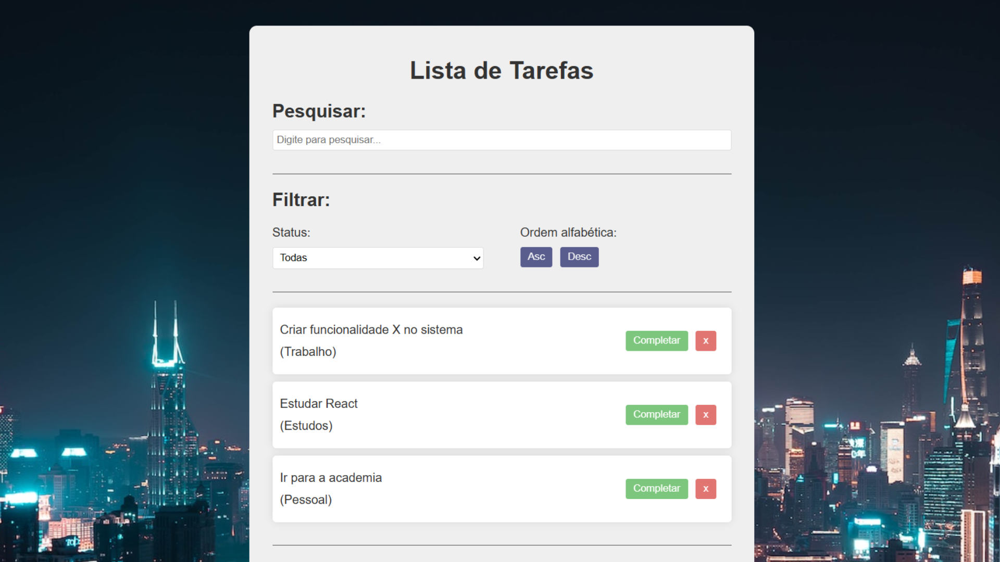

# Lista de Tarefas

## Projeto 💻
Projeto desenvolvido por meio de um vídeo no YouTube do canal do Matheus Battisti - Hora de Codar.
- YouTube: [PROJETO de React JS para INICIANTES - Faça uma To Do List do zero!](https://youtu.be/YVEVrigByKY?si=0tqICnI3-GhnEWwh)

## Instalação 🛠
Siga esses passos para instalar o repositório:
1. Rode `git clone https://github.com/dudaishiyama/Lista-de-Tarefas` para fazer um clone desse repositório.
2. Rode `npm i` para instalar as dependências do projeto.
3. Rode `npm run dev` para iniciar o servidor de desenvolvimento.
4. Entre no link que aparecer no terminal.

## Tecnologias 🚀
As tecnologias utilizadas nesse projeto são:
- HTML
- CSS
- JavaScript
- React
- React DOM

## Créditos ❤️
Feito por [Duda Ishiyama](https://github.com/dudaishiyama/).